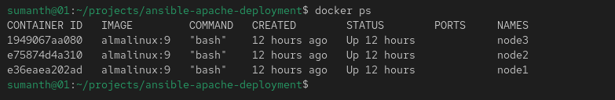
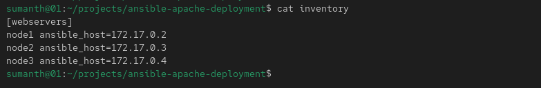
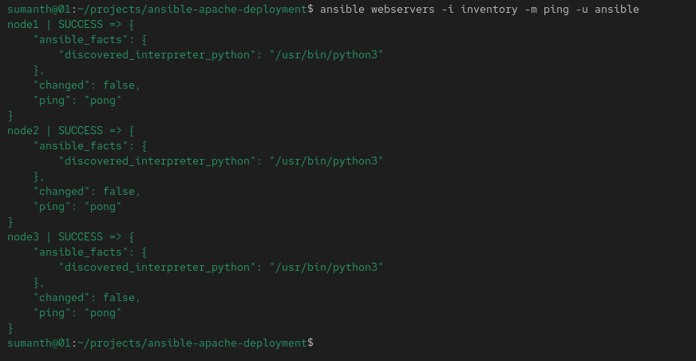
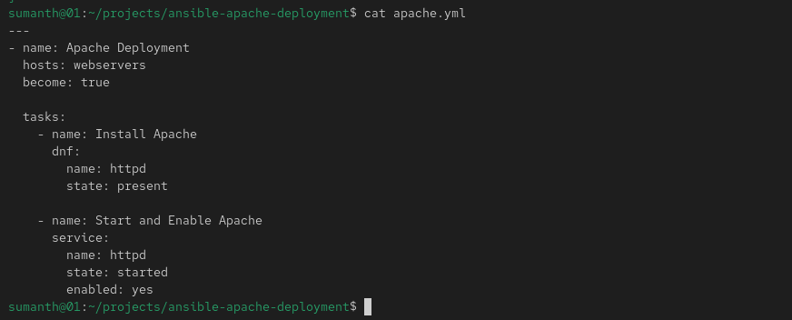
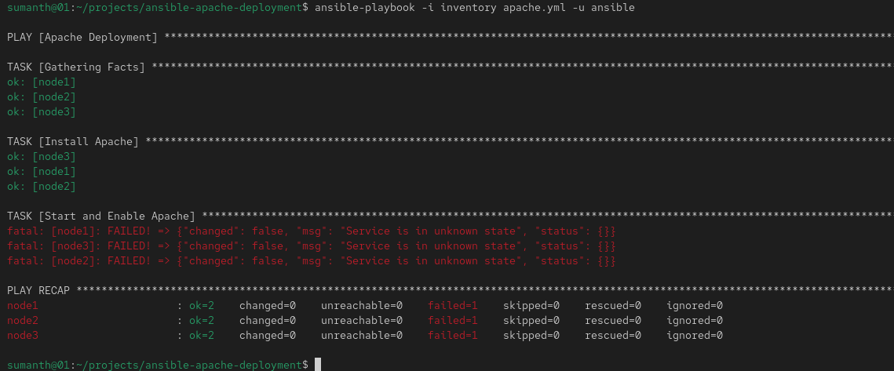
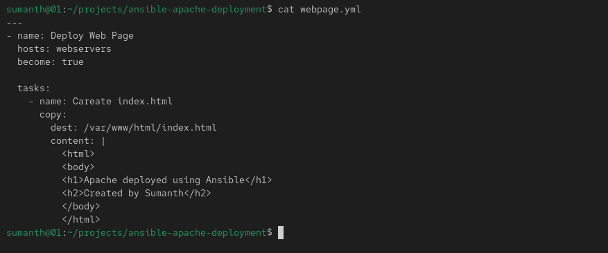
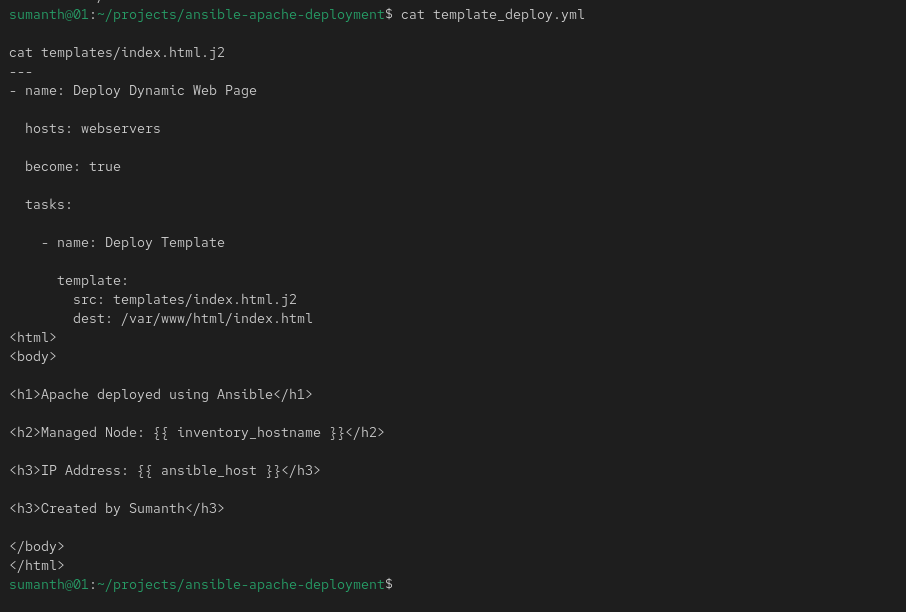
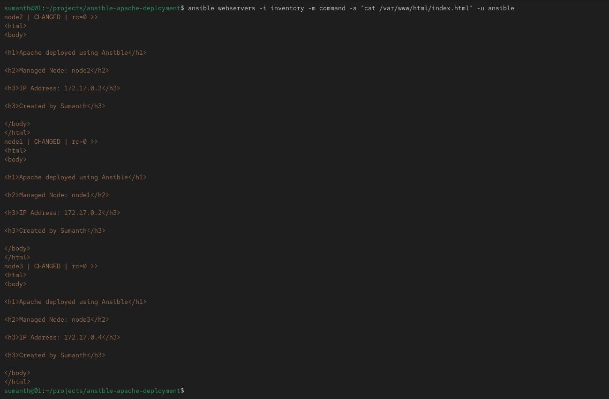
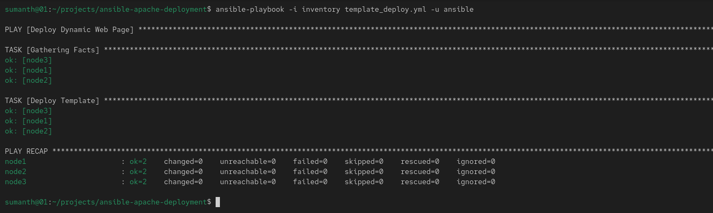

# Ansible Apache Deployment Lab

## Overview

This project demonstrates Apache deployment automation using Ansible across multiple AlmaLinux nodes running in Docker containers.

The lab covers:

* Inventory Management
* SSH Key Authentication
* Ansible Playbooks
* Package Management
* File Deployment
* Jinja2 Templates
* Multi-node Automation
* Idempotency

---

## Environment

| Component     | Details      |
| ------------- | ------------ |
| OS            | AlmaLinux    |
| Ansible       | Core 2.16    |
| Web Server    | Apache HTTPD |
| Containers    | Docker       |
| Managed Nodes | 3            |

---

## Project Architecture

Control Node

* Ansible Controller

Managed Nodes

* node1 (172.17.0.2)
* node2 (172.17.0.3)
* node3 (172.17.0.4)

---

## 1. Docker Containers

Three AlmaLinux containers were created to act as managed nodes.

---

## 2. Ansible Inventory

Configured inventory with all managed nodes.

---

## 3. Connectivity Verification

Verified connectivity using the Ansible ping module.

---

## 4. Apache Installation Playbook

Created a playbook to install Apache across all nodes.

---

## 5. Apache Deployment

Executed the playbook and installed Apache successfully on all managed nodes.

---

## 6. Static Webpage Deployment

Used the Ansible copy module to deploy a custom web page.

---

## 7. Dynamic Content using Templates

Used the template module and Jinja2 templates to generate node-specific web pages.

---

## 8. Template Output Verification

Verified that each node received customized content containing hostname and IP address.

---

## 9. Idempotency Demonstration

Re-ran the playbook and verified that no unnecessary changes were made.

---

## Files Included

| File                    | Description                  |
| ----------------------- | ---------------------------- |
| inventory               | Ansible inventory            |
| apache.yml              | Apache installation playbook |
| webpage.yml             | Static webpage deployment    |
| template_deploy.yml     | Template deployment playbook |
| templates/index.html.j2 | Jinja2 template              |

---

## Skills Demonstrated

* Linux Administration
* Ansible Inventory Management
* SSH Authentication
* YAML Playbooks
* Apache Deployment
* Jinja2 Templates
* Configuration Management
* Infrastructure Automation
* Troubleshooting
* Idempotency

---

## Author

Sumanth

Linux System Administrator | Aspiring DevOps Engineer
